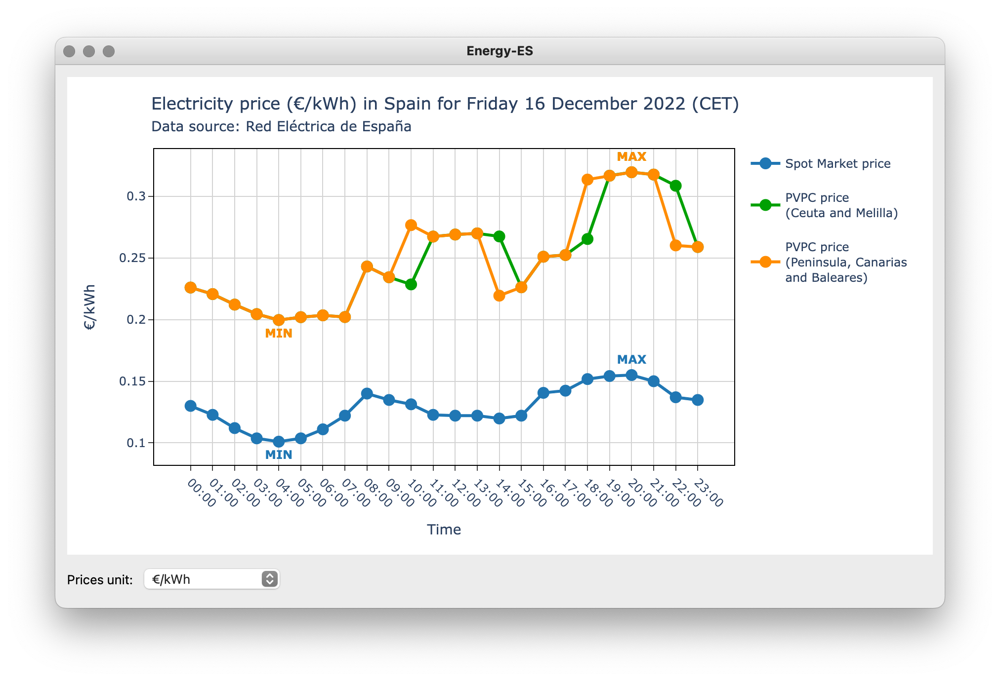

# Energy-ES
Energy-ES is a desktop application that shows an interactive chart with the
hourly values of the Spot Market and PVPC energy prices of the current day in
Spain. The data is provided by the API of Red Electrica.

- Version: 0.1.0
- Author: Jose A. Jimenez (jajimenezcarm@gmail.com)
- License: MIT License
- Repository: https://github.com/jajimenez/energy-es



## How to install

We can install Energy-ES in the following ways:

### Install from PyPI (Python Package Index)

```bash
pip install energy-es
```

### Install from the source code

```bash
python setup.py install
```

### Generate a package and install it

We can generate and install the **built package** or the **source archive**
from the source code. The *wheel* package is needed for generating the built
package.

To generate and install the **built package** (preferred), run the following
commands from the project directory:

```bash
pip install wheel
python setup.py bdist_wheel
pip install ./dist/energy-es*.whl
```

To generate and install the **source archive**, run the following commands from
the project directory:

```bash
python setup.py sdist
pip install ./dist/energy-es*.tar.gz
```

## How to run

Once Energy-ES is installed, we can run it with this command:

```bash
energy-es
```

## How to run the unit tests

To run all the unit tests, run the following command from the project
directory:

```bash
python -m unittest discover test
```
